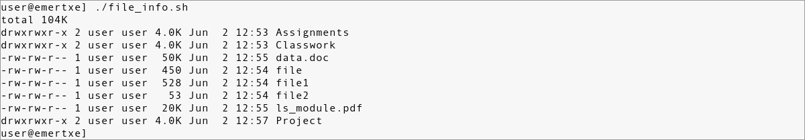
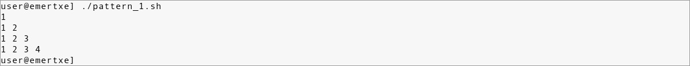
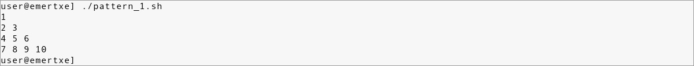
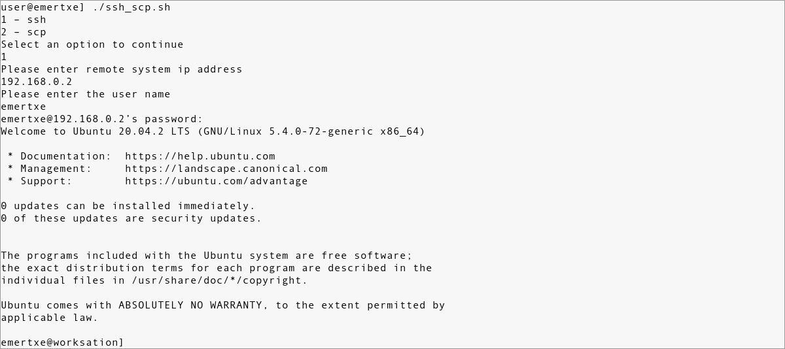
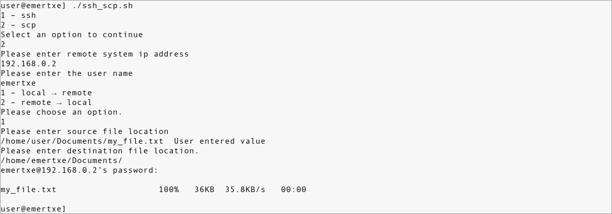

# This is little exercise for bash-script
##    A1: Write a script for printing all file related information in present working directory (e.g.: size, permission & size etc…)
        Prerequisites:

        How to execute a bash script.
        How to change execute permission of a file.
        How read man-page of a command.
        Objective:

        To understand how to write and execute a basic bash script
        Requirements:

        When you run the script, display all file information from current working directory
        Sample Execution / Output:

        Test Case 1:
        
##    A2: Read ‘n’ and generate a pattern given below
        Pattern

        1
        1 2
        1 2 3
        1 2 3 4

        Prerequisites:

        How to run a loops in shell scripts.
        How to execute a bash script.
        How to change execute permission of a file.
        Objective:

        To understand the working of loops in a script.
        Requirements:

        Read a value from user
        Create a pattern as mentioned above
        Sample Execution / Output:

        Test Case 1:
        

##    A3: Read ‘n’ and generate a pattern given below
        Pattern

        1
        2 3
        4 5 6
        7 8 9 10

        Prerequisites:

        How to run a loops in shell scripts.
        How to execute a bash script.
        How to change execute permission of a file.
        Objective:

        To understand the working of loops in a script.
        Requirements:

        Read a value from user
        Create a pattern as mentioned above
        Sample Execution / Output:
        
##    A4: Write a script for scp & ssh by demonstrating remote login & file transfer functions
        Prerequisites:

        Knowledge about ssh and scp commands.
        Use of “case” in shell script.
        Copy files/directories with cp command
        Objective:

        To understand working of scp and ssh commands.
        Requirements:

        Provide a menu to user to select ssh or scp
        Based on user selection ask for user name and ip-address.
        For scp ask user for direction of copy
        remote to local
        local to remote.
        copy file to destination home directory with same source file name.
        Ask for source/destination file location. If no destination location is provided
        If user gives destination along with filename, keep that as destination filename.
        If user provides only destination location (no file name), keep as source file name
        Note: User should know the password for remote user.
        Sample Execution / Output:

        Test Case 1:
        
        

        Test case 2:
        

##    A5: Write a script for addition of two numbers for real numbers also
        Prerequisites:
        
        How to add real numbers in script.
        How to use piping in commands.
        Objective:
        
        To understand working of piping.
        To learn arithmetic operations in shell script
        Requirements:
        
        Ask user to enter two numbers
        User can enter real numbers also
        Use bc command and piping to do
        Sample Execution / Output:
        
        Test Case 1:
        

##    A6: Write a script for arithmetic calculator using command line arguments
##    A7: Write a script to compare larger integer values from a ‘n’ number of arguments using command line arguments
##    A8: Write a script to print a given number in reverse order
##    A9: Write a script to delete empty lines from a file
##    A10: Write a script to perform arithmetic operation on digits of a given number depending upon the operator
##    A11: Read ‘n’ and generate Fibonacci numbers less than or equal to n
##    A12: Write a script to print the length of each and every string using arrays
##    A13: Write a script to print chess board
##    A14: Write a script to sort a given number in ascending or descending order
##    A15: Write a script to print the following system information
##    A16: Read ‘n’ and print the greatest Fibonacci number less than or equal to n
##    A17: Write a script to rename a file/directory replaced by lower/upper case letters
##    A18: Write a script to rename current working directory with given name
##    A19: Given album name and directory create a script to name files properly by inserting index numbers.
##    A20: Write script to print contents of file from given line number to next given number of lines
##    A21: Write script called say_hello, which will print greetings based on time
##    A22: Shell script to convert string lower to upper and upper to lower
##    A23: Display the longest and shortest user-names on the system
##    A24: Write a script to delete all the .swp files found in your system or directory
##    A25: Write a script for generating random 8-character passwords including alpha numeric characters
##    A26: Write a script that takes any number of directories as command-line arguments and then lists the contents of each of these directories
##    A27: Use pipes or redirection to create an infinite feedback loop
##    A28: Use a recursive function to print each argument passed to the function
##    A29: Write a script to determine whether a given file system or mount point is mounted
##    A30: Write a script to locks down file permissions for a particular directory
##    A31: Display the names of any file-system which have less than 10% free space available
##    A32: Count the number of users with user IDs between 500 and 10000 on the system
##    A33: For each directory in the $PATH, display the number of executable files in that directory
##    A34: Write a script to search a user present in your system
##    A35: Write a script to replace 20% lines in a C file randomly and replace it with the pattern
